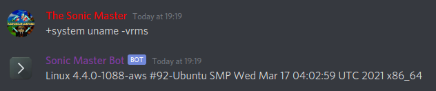

# system

This plugin allows you to run system (shell) commands straight from Discord! Unleash your inner geek with the ability to leverage Unix/Linux programs like `uname`, `grep`, or any other program installed on the system that is hosting your bot.
